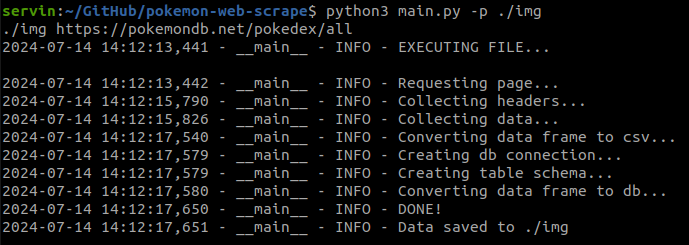
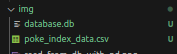
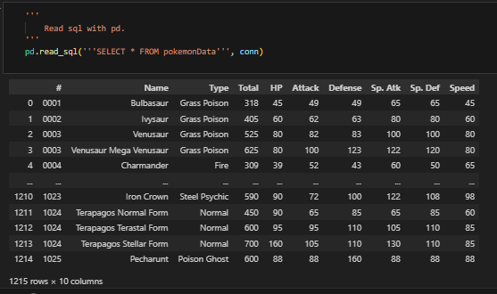
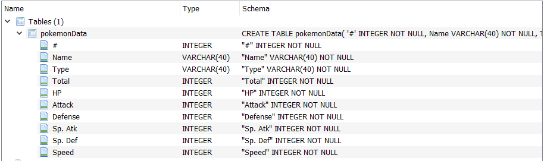
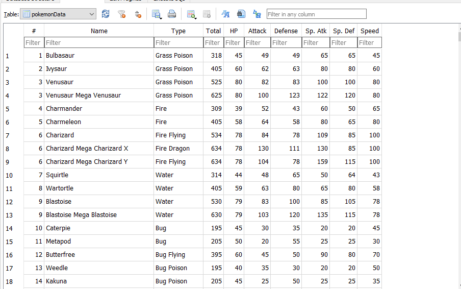

<div align='center'>

[](https://github.com/Serv08/pokemon-web-scrape/issues)
[](https://github.com/Serv08/pokemon-web-scrape/pulls)


</div>

---
## [Sir Josh challenge](https://www.facebook.com/share/p/shSjfPoG5PaD6bnm/): Scraping data from the [Pokémon Pokédex](https://pokemondb.net/pokedex/all).


This project aims to scrape data from a Pokémon Pokédex website which involves web scraping, data cleaning, and storing the data in an SQLite database.

### Key Features:
1. **Web Scraping**: Utilizes Python libraries such as requests and BeautifulSoup to extract data from a specified Pokémon Pokédex website.
The scraper captures detailed information for each Pokémon, including name, type, stats, and other relevant attributes.

2. **Data Cleaning and Transformation**: Uses pandas to clean and transform the scraped data into a tabular format.
Handles data inconsistencies and ensures that all fields are correctly formatted for storage.

3. **Database Integration**: Implements an SQLite database to store the processed data.
The sqlite3 library is used to create tables and insert records, making the data easily accessible for querying and analysis.

4. **Data Storage and Retrieval**: Provides functions to store the scraped data into an SQLite database and retrieve it for further analysis or usage.


## Usage:

### Execution of code in terminal

When running the file in terminal, `-p` flag can be used to indicate the filepath where the `.db` and `.csv` file will be saved. The path is `./data` by default.

#### Running the python script by default.
```bash
python3 main.py 
```
#### Running the python script and saving in another file path (*saved in the relative `./img` path*).
```bash
python3 main.py -p ./img
```

<p align='center'></p>

<p align='center'></p>
<p align='center'><i>Saved data</i></p>

### Saving and reading database with pandas library (*from Jupyter Notebook*).
<p align='center'></img></p>

### Snapshots from database (*using SQLite*).
Had to use `'append'` rather than `'replace'` for `if_exists=` argument when creating database from DataFrame to append DataFrame values in the database table. Using `'replace'` would lead to the data types of columns to be in `TEXT` forms and will not follow the table schema created by `self.create_table_schema()` function.
```bash
self.df.to_sql('pokemonData', self.conn, if_exists='append', index = False)
```
<p align='center'></img></p>
<p align='center'></img></p>


## Libraries

|Libraries used|PIP command|Description|
|---|---|:-:|
|bs4|`pip install bs4`| Beautiful Soup is a library that makes it easy to scrape information from web pages|
|requests|`pip install requests`|Allows you to send HTTP requests using Python.|
|pandas| `pip install pandas`| A Python library used for working with data sets.|

## References

### Tutorial Videos:
- [Scraping Data from a Real Website | Web Scraping in Python](https://www.youtube.com/watch?v=8dTpNajxaH0) by *Alex the Analyst*.
- [Upload A CSV File (Or Any Data File) To SQLite Using Python](https://www.youtube.com/watch?v=UZIhVmkrAEs) by *Jie Jenn*.

### Reading Material:
- [SQLite with Python using CSV files.](https://medium.com/@eliud.giroma/sqlite-with-python-using-csv-files-6772bdd3fc5e) by *Eliud Rodríguez*.

### Error handling:
- [Windows not letting executable files create changes.](https://www.reddit.com/r/learnpython/comments/1af0hti/oserror_errno_9_bad_file_descriptor/)
