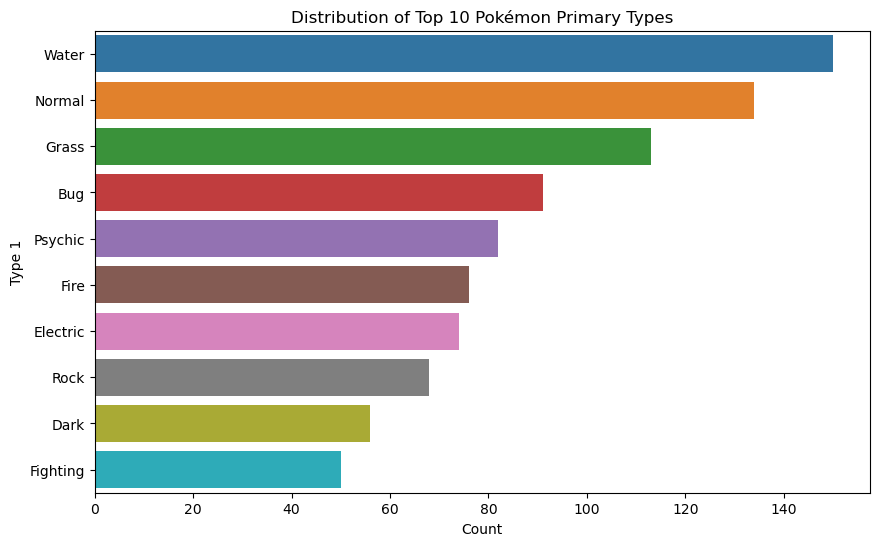

##  ETL Process

## Sample Visualizations (*with Matplotlib*)

### Top 10 Primary Types 
Water type is the most common Pokemon type followed by Normal and Grass.

### Attack Distribution
Dragon type have the highest median distribution for attack. 

### Defense Distribution
Steel type have the highest median distribution in terms of defense, followed by Rock type.

